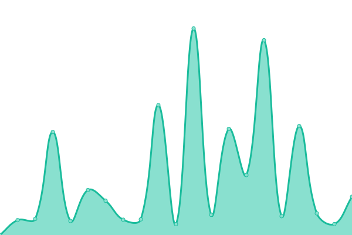

# [📈 Live Status](https://upptime.github.io/upptime): <!--live status--> **🟧 Partial outage**

This repository contains the open-source uptime monitor and status page for [Upptime](https://upptime.js.org), powered by [Upptime](https://github.com/upptime/upptime).

With [Upptime](https://upptime.js.org), you can get your own unlimited and free uptime monitor and status page, powered entirely by a GitHub repository. We use [Issues](https://github.com/upptime/upptime/issues) as incident reports, [Actions](https://github.com/khadanja/upptime/actions) as uptime monitors, and [Pages](https://upptime.github.io/upptime) for the status page.

<!--start: status pages-->
<!-- This summary is generated by Upptime (https://github.com/upptime/upptime) -->
<!-- Do not edit this manually, your changes will be overwritten -->
<!-- prettier-ignore -->
| URL | Status | History | Response Time | Uptime |
| --- | ------ | ------- | ------------- | ------ |
|  [Wikipedia](https://en.wikipedia.org) | 🟩 Up | [wikipedia.yml](https://github.com/khadanja/upptime/commits/HEAD/history/wikipedia.yml) | 

 198ms
     
 | 

<a href="https://khadanja.github.io/upptime/history/wikipedia">100.00%</a>
    

|  AU | 🟩 Up | [au.yml](https://github.com/khadanja/upptime/commits/HEAD/history/au.yml) | 

 2746ms
     
 | 

<a href="https://khadanja.github.io/upptime/history/au">13.80%</a>
    

|  P | 🟥 Down | [p.yml](https://github.com/khadanja/upptime/commits/HEAD/history/p.yml) | 

 2476ms
     
 | 

<a href="https://khadanja.github.io/upptime/history/p">13.80%</a>
    

|  SF | 🟥 Down | [sf.yml](https://github.com/khadanja/upptime/commits/HEAD/history/sf.yml) | 

 2578ms
     
 | 

<a href="https://khadanja.github.io/upptime/history/sf">0.00%</a>
    

|  V | 🟩 Up | [v.yml](https://github.com/khadanja/upptime/commits/HEAD/history/v.yml) | 

 2413ms
     
 | 

<a href="https://khadanja.github.io/upptime/history/v">13.80%</a>
    

<!--end: status pages-->

[**Visit our status website →**](https://khadanja.github.io/upptime)

## 📄 License

- Powered by: [Upptime](https://github.com/upptime/upptime)
- Code: [MIT](./LICENSE) © [Upptime](https://upptime.js.org)
- Data in the `./history` directory: [Open Database License](https://opendatacommons.org/licenses/odbl/1-0/)
