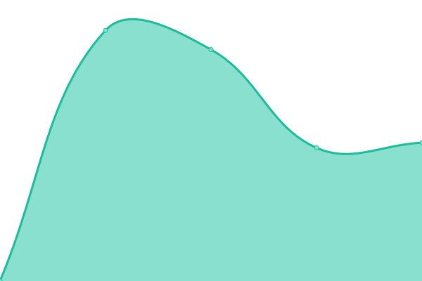

# [📈 Live Status](https://upptime.github.io/upptime): <!--live status--> **🟧 Partial outage**

This repository contains the open-source uptime monitor and status page for [Upptime](https://upptime.js.org), powered by [Upptime](https://github.com/upptime/upptime).

With [Upptime](https://upptime.js.org), you can get your own unlimited and free uptime monitor and status page, powered entirely by a GitHub repository. We use [Issues](https://github.com/upptime/upptime/issues) as incident reports, [Actions](https://github.com/khadanja/upptime/actions) as uptime monitors, and [Pages](https://upptime.github.io/upptime) for the status page.

<!--start: status pages-->
<!-- This summary is generated by Upptime (https://github.com/upptime/upptime) -->
<!-- Do not edit this manually, your changes will be overwritten -->
<!-- prettier-ignore -->
| URL | Status | History | Response Time | Uptime |
| --- | ------ | ------- | ------------- | ------ |
|  [Wikipedia](https://en.wikipedia.org) | 🟩 Up | [wikipedia.yml](https://github.com/khadanja/upptime/commits/HEAD/history/wikipedia.yml) | 

 205ms
     
 | 

<a href="https://khadanja.github.io/upptime/history/wikipedia">100.00%</a>
    

|  [Portainer](https://p.orionstark.tk) | 🟥 Down | [portainer.yml](https://github.com/khadanja/upptime/commits/HEAD/history/portainer.yml) | 

 119ms
     
 | 

<a href="https://khadanja.github.io/upptime/history/portainer">1.01%</a>
    

|  [OMV](https://orionstark.tk) | 🟥 Down | [omv.yml](https://github.com/khadanja/upptime/commits/HEAD/history/omv.yml) | 

 130ms
     
 | 

<a href="https://khadanja.github.io/upptime/history/omv">1.01%</a>
    

|  [Authelia](https://au.orionstark.tk) | 🟥 Down | [authelia.yml](https://github.com/khadanja/upptime/commits/HEAD/history/authelia.yml) | 

 109ms
     
 | 

<a href="https://khadanja.github.io/upptime/history/authelia">1.01%</a>
    

|  [SeaFile](https://sf.orionstark.tk) | 🟥 Down | [sea-file.yml](https://github.com/khadanja/upptime/commits/HEAD/history/sea-file.yml) | 

 107ms
     
 | 

<a href="https://khadanja.github.io/upptime/history/sea-file">1.01%</a>
    

|  [W4L Dev](https://dev.greynoise.xyz) | 🟩 Up | [w4-l-dev.yml](https://github.com/khadanja/upptime/commits/HEAD/history/w4-l-dev.yml) | 

 4022ms
     
 | 

<a href="https://khadanja.github.io/upptime/history/w4-l-dev">100.00%</a>
    

<!--end: status pages-->

[**Visit our status website →**](https://khadanja.github.io/upptime)

## 📄 License

- Powered by: [Upptime](https://github.com/upptime/upptime)
- Code: [MIT](./LICENSE) © [Upptime](https://upptime.js.org)
- Data in the `./history` directory: [Open Database License](https://opendatacommons.org/licenses/odbl/1-0/)
