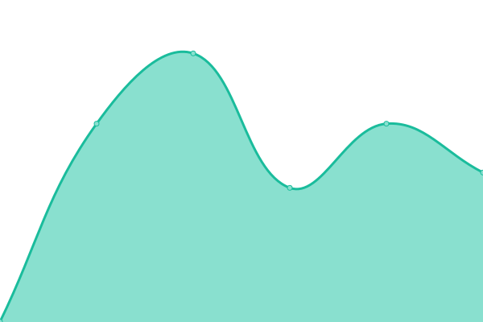
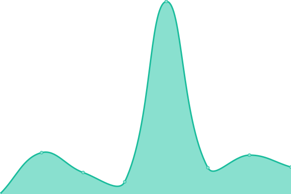

# [📈 Live Status](https://upptime.github.io/upptime): <!--live status--> **🟧 Partial outage**

This repository contains the open-source uptime monitor and status page for [Upptime](https://upptime.js.org), powered by [Upptime](https://github.com/upptime/upptime).

With [Upptime](https://upptime.js.org), you can get your own unlimited and free uptime monitor and status page, powered entirely by a GitHub repository. We use [Issues](https://github.com/upptime/upptime/issues) as incident reports, [Actions](https://github.com/khadanja/upptime/actions) as uptime monitors, and [Pages](https://upptime.github.io/upptime) for the status page.

<!--start: status pages-->
<!-- This summary is generated by Upptime (https://github.com/upptime/upptime) -->
<!-- Do not edit this manually, your changes will be overwritten -->
<!-- prettier-ignore -->
| URL | Status | History | Response Time | Uptime |
| --- | ------ | ------- | ------------- | ------ |
|  [Uptime Kuma](https://up.nest.gq) | 🟩 Up | [uptime-kuma.yml](https://github.com/khadanja/upptime/commits/HEAD/history/uptime-kuma.yml) | 

 747ms
     
 | 

<a href="https://khadanja.github.io/upptime/history/uptime-kuma">100.00%</a>
    

|  [Traefik](https://traefik.nest.gq) | 🟥 Down | [traefik.yml](https://github.com/khadanja/upptime/commits/HEAD/history/traefik.yml) | 

 617ms
     
 | 

<a href="https://khadanja.github.io/upptime/history/traefik">9.77%</a>
    

|  [Portainer](https://portainer.nest.gq) | 🟩 Up | [portainer.yml](https://github.com/khadanja/upptime/commits/HEAD/history/portainer.yml) | 

 1066ms
     
 | 

<a href="https://khadanja.github.io/upptime/history/portainer">100.00%</a>
    

<!--end: status pages-->

[**Visit our status website →**](https://upptime.github.io/upptime)

## 📄 License

- Powered by: [Upptime](https://github.com/upptime/upptime)
- Code: [MIT](./LICENSE) © [Upptime](https://upptime.js.org)
- Data in the `./history` directory: [Open Database License](https://opendatacommons.org/licenses/odbl/1-0/)
